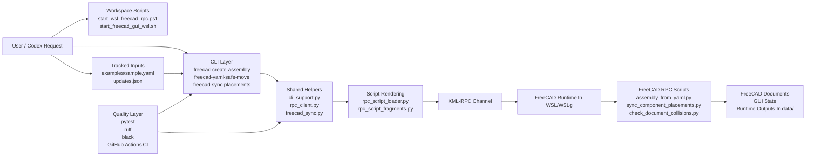
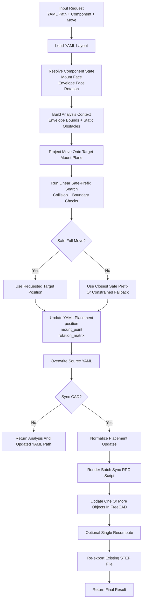
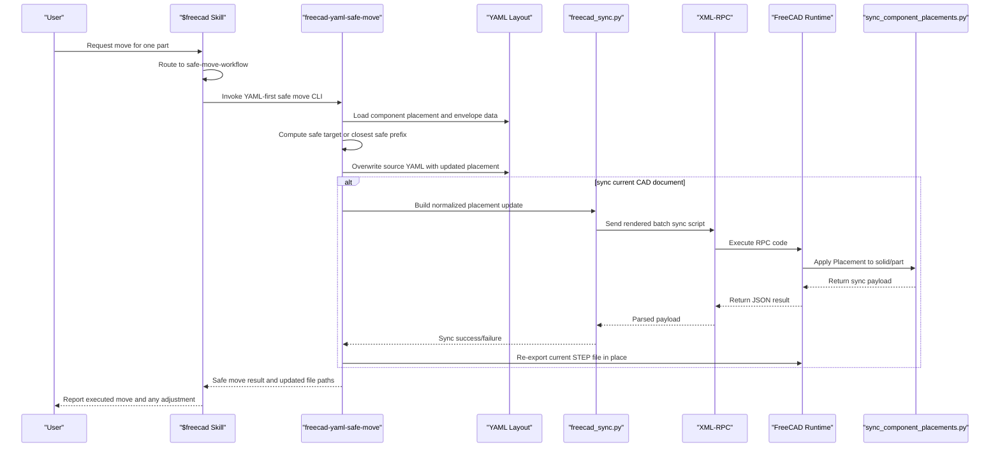

# System Architecture And Workflow / 系统架构与流程图

This document provides a visual overview of the `skills_test` workspace and the main FreeCAD automation flow.

本文档用于展示 `skills_test` 工作区的核心系统结构，以及 FreeCAD 自动化的主流程。

## System Architecture

## Main Safe-Move Workflow

## Move-Part Sequence Diagram

## Notes

- `examples/` stores tracked sample inputs.
- `data/` stores generated files and verification outputs, and is intentionally ignored by git.
- `freecad-yaml-safe-move` is the YAML-first path for collision-aware movement.
- `freecad-sync-placements` is the reusable batch placement path for faster multi-component updates.
- The current skill workflow overwrites the existing YAML and re-exports the existing `STEP` file in place for move/rotate requests.

## 中文说明

- `examples/` 用于保存被版本控制跟踪的示例输入。
- `data/` 用于保存运行期输出和验证产物，默认不进入 git。
- `freecad-yaml-safe-move` 是面向 YAML 的安全移动主路径。
- `freecad-sync-placements` 是面向多组件同步的批量更新路径。
